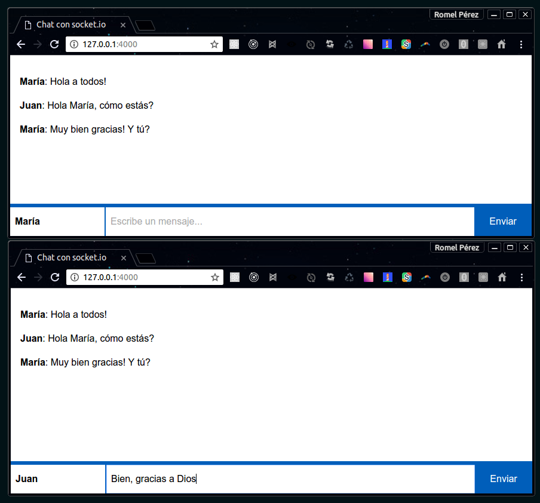

# Chat

[](http://meetup.com/BucaramangaJS)
[](./LICENSE)

Ejemplo de [Web Sockets](https://medium.com/bucaramangajs/real-time-websockets-25fa0cb520b4) con [Node.js](http://nodejs.org) y [socket.io](http://socket.io).



## Anatomía

- `package.json` - Definición del proyecto en Node.js
- `server.js` - Servidor de sockets con socket.io y express.js
- `client.js` - Aplicación del socket del cliente
- `index.html` - Interfaz HTML del chat
- `styles.css` - Diseño de la interfaz

## Instalación

Teniendo instalados Node.js y npm en el sistema, ejecutar:

```bash
$ npm install
```

## Ejecución

Este iniciará el servidor de sockets en `http://127.0.0.1:4000`.

```bash
$ npm run start
```
